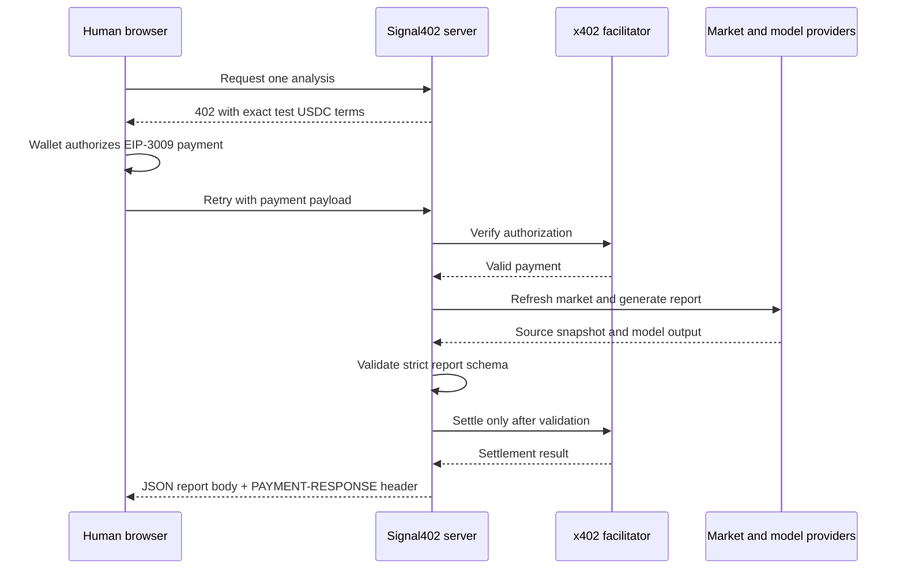
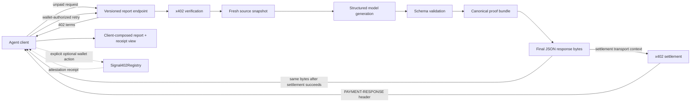

# Signal402 agent protocol wireframe

Status: **pre-event wireframe only; no implementation is claimed.**

This document defines the intended boundaries of the substantive in-window
feature without providing production code. The immutable product baseline is
`arbitrum-singapore-pre-event-2026-09-07`; implementation begins only after the
official Sep 14, 2026 start is verified and recorded.

## Baseline flow

The baseline already supports a human-facing paid report. It does not yet
publish a stable agent contract, deterministic proof bundle, machine reference
client, or report-specific registry action.

## Target in-window flow

The registry path stays separate from payment. A failed or skipped attestation
must not invalidate a successfully purchased report, and the server must never
sign the user's registry transaction. The authoritative settlement result is
the decoded `PAYMENT-RESPONSE` header; the JSON body and receipt are not one
server-generated envelope. See `docs/x402-response-boundary.md`.

## Planned response boundary

The final response should group the following concepts under an explicit schema
version. Exact names and serialization rules are implementation decisions for
the official window.

| Group | Required meaning | Claim boundary |
| --- | --- | --- |
| Request | Market identifier, request identifier, and creation time | No user identity unless required for payment evidence |
| Source | Fresh normalized market snapshot and upstream references | No claim that upstream data is complete or prediction truth |
| Analysis | Estimate, evidence, counterarguments, risks, and assumptions | Informational output, never trade advice or guaranteed accuracy |
| Generation | Provider/model identifier, validation status, and timing | No secret prompt, credential, or provider token |
| Proof | Deterministic market and content hashes plus registry call preview | Hashes only; never publish the private report body onchain |
| Payment context in JSON body | Expected network, asset, amount, recipient, protocol, and `PAYMENT-RESPONSE` receipt-channel name | Terms are not proof that settlement succeeded |
| Settlement in response header | Authoritative success, transaction, network, settled amount, payer, and protocol extensions decoded from `PAYMENT-RESPONSE` | Testnet evidence is not customer revenue; the server must not duplicate or contradict these fields in the body |
| Attestation | Canonical registry, chain, deterministic call arguments, optional transaction, emitted attestation ID, and status | User-controlled and optional; no ID exists before mining |

## State wireframe

| Client-visible state | Server behavior | Wallet behavior |
| --- | --- | --- |
| Payment required | Return one valid x402 v2 requirement | No prompt until the client chooses to continue |
| Authorization pending | Perform no provider work and no settlement | Show exact testnet, asset, amount, and recipient |
| Payment verified | Refresh the source and generate the report | No second authorization for the same request |
| Provider or validation failure | Cancel the verified payment path and return a typed failure | Show that no settlement receipt exists |
| Report delivered | Return the validated JSON body unchanged and the settlement receipt in `PAYMENT-RESPONSE` | Validate both channels, compose the display object locally, and link the Arbitrum Sepolia transaction |
| Attestation offered | Return deterministic call data and canonical registry details; omit the not-yet-created attestation ID | Require a separate, explicit wallet confirmation |
| Attestation confirmed | Decode the real ID from `InsightAttested`, verify stored data, and record the transaction as optional proof | Link the registry transaction |

## Decisions reserved for the official window

- Validate the RFC 8785 JCS, domain-separated `keccak256`, and covered-field
  candidate in `docs/canonical-proof-wireframe.md` before writing hash code;
  record any incompatible revision under a new schema/domain version.
- Decide whether a request identifier is random, content-derived, or both.
- Define idempotency and replay behavior for paid retries.
- Define typed failures for market refresh, provider output, parsing, schema
  validation, verification, settlement, and optional attestation.
- Keep authoritative settlement fields in `PAYMENT-RESPONSE`; define the exact
  non-authoritative payment context allowed in the JSON body and ensure the
  bytes passed into settlement are the bytes ultimately delivered.
- Keep the registry preview limited to chain, address, function, and arguments.
  The contract hashes caller address and inclusion block into `attestationId`,
  so only the mined event can supply the authoritative ID.
- Confirm that logs and evaluation fixtures never expose payment signatures,
  credentials, private report bodies, or personal data.

## Evidence required before claiming completion

1. A commit-linked versioned endpoint and public schema documentation.
2. Tests for the unpaid 402 response, paid retry, stable hashes, changed-content
   hashes, idempotency, exact response-body preservation, standard receipt
   header validation, and every pre-settlement failure path.
3. A minimal agent client that demonstrates authorization without embedding a
   funded private key.
4. One owner-approved Arbitrum Sepolia purchase receipt created in-window.
5. One separately owner-approved optional registry attestation created
   in-window, with its ID decoded from the event and its stored fields verified.
6. A production deployment identifier, smoke-test transcript, and final
   tag-to-head comparison.

Any wallet authorization, paid request, registry transaction, deployment, or
public release remains subject to the owner's explicit confirmation.
