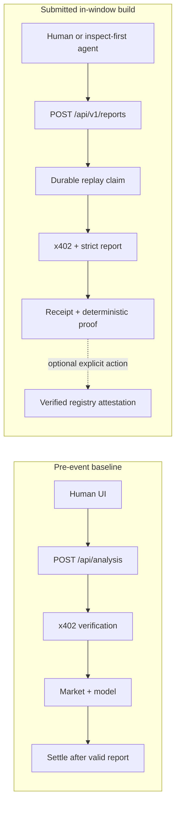

# Signal402 final three-minute demo plan

Status: **pre-event storyboard only. Do not record or publish this as the final
Buildathon demo until the cited in-window build and evidence exist.**

Target duration: **2:45–2:55**, leaving upload/transcoding margin below three
minutes. The final recording must use the deployed commit being submitted. A
wallet signature, paid request, attestation transaction, video upload, or public
field replacement remains separately owner-gated.

## Narrative rule

The demo answers five questions in this order:

1. What bounded problem is being solved?
2. What does the buyer see before authorizing payment?
3. What happens on Arbitrum and what does the buyer receive?
4. What prevents unsafe retries or payment for a failed result?
5. What is genuinely new during the Buildathon, and what remains limited?

Do not start with architecture, sponsors, token economics, a team biography, or
the full market browser. Show the paid-agent workflow first, then the evidence
that makes it credible.

## Timed storyboard

### 0:00–0:18 — Problem and promise

Visual: clean product title, one live market card, and the one-line workflow:

```text
Inspect terms → authorize once → receive report + receipt → verify proof
```

Draft narration:

> Prediction-market probabilities are public, but contextual research is often
> sold through accounts and subscriptions. Signal402 lets a person or an agent
> buy one structured report with one explicit test-USDC authorization on
> Arbitrum. It never places trades or custodies funds.

Evidence gate: the one-line pitch and non-custodial claim must match the final
route, wallet flow, and submitted build.

### 0:18–0:43 — Free source context

Visual: open one preselected live Polymarket event and briefly show question,
outcomes, probability, source link, and update time. Use a market whose outcome
shape passes the final strict adapter.

Draft narration:

> The market context is free to inspect. The submitted server refreshes this
> source snapshot itself; it rejects an unsupported market shape instead of
> silently inventing Yes and No data.

Evidence gate: capture a same-day production smoke result and exact selected
market ID. Do not say the source is complete, accurate, endorsed, or private.

### 0:43–1:10 — Machine-readable 402 before signing

Visual: run the final reference client in `inspect` mode. Render a human-safe
summary rather than the raw payment header:

- `POST /api/v1/reports`;
- Arbitrum Sepolia / `eip155:421614`;
- test USDC contract;
- `0.01` USDC / `10000` atomic units;
- recipient;
- `signer calls: 0`.

Draft narration:

> The default agent client does not pay. It validates the exact route, chain,
> token, amount, recipient, timeout, and transfer method, then stops with zero
> signer calls. A mismatched or redirected quote fails closed.

Evidence gate: production 402, exact-policy tests, redirect/mismatch fixtures,
and inspect signer count must all pass on the submitted commit.

### 1:10–1:43 — One approved purchase

Preferred visual: replay a clean, owner-approved, in-window recording of the
single wallet confirmation followed by the paid client result. Keep the
network, amount, and recipient readable. Cut all account chrome and notifications.

Draft narration:

> For this testnet purchase I explicitly authorize one EIP-3009 payload. The
> server atomically claims the purchase tuple, verifies the authorization,
> refreshes the market,
> validates the structured model output, and settles only after the final
> response bytes exist.

Use a previously completed in-window purchase rather than requesting another
signature during final recording. A live signature is allowed only after a new
exact owner confirmation. Never simulate a wallet approval visually or present
a baseline receipt as the in-window purchase.

Evidence gate: single signer call, one provider call, one settlement attempt,
final deployment commit, public transaction, and exact response-byte test.

### 1:43–2:08 — Report, receipt, and content proof

Visual: show the structured report, then a split proof panel:

```text
Server JSON body                 Standard PAYMENT-RESPONSE header
source + analysis + hashes       success + network + transaction (+ payer)
```

Recompute `contentHash` in the client and open the Arbitrum Sepolia transaction
link. Keep the raw server body visibly separate from the client-composed receipt
view.

Draft narration:

> The report and settlement evidence are separate channels. The client validates
> the versioned report, decodes the standard x402 receipt, and independently
> recomputes the deterministic content hash. It never invents receipt fields
> from the JSON body.

Evidence gate: strict schema, request identity, receipt header, transaction,
hash vectors, and deployed-body verification.

### 2:08–2:30 — Failure and retry safety

Visual: a compact deterministic evaluation card, not scrolling test logs:

```text
16 concurrent deliveries → 1 provider call → 1 settlement attempt
provider/schema failure   → 0 settlement calls
ambiguous settlement      → STOP / reconcile; no new signature
```

Draft narration:

> Token nonce protection is not enough for an API purchase. Signal402 binds the
> request and exact credential to durable application state. Concurrent replay
> is serialized, provider failure is not settled, and an ambiguous result stops
> for reconciliation instead of asking for a fresh authorization.

Evidence gate: the displayed integer counts must be copied from reviewed
`replay-concurrency.json` and `tests.json`; do not claim generic exactly-once
delivery.

### 2:30–2:43 — Optional public commitment

Visual: show the zero-value registry call preview and the separately approved
in-window attestation receipt, event ID, and mapping readback. If the final
attestation is absent or unresolved, omit this shot rather than weakening the
payment story.

Draft narration:

> Separately, the buyer may commit the report hashes to the verified
> Signal402Registry. This optional transaction proves that a wallet published
> those hashes; it does not prove that the analysis is true or that the wallet
> purchased it.

Evidence gate: canonical code hash, simulation, public transaction, decoded
event/ID, and mapping agreement.

### 2:43–2:55 — Buildathon delta and close

Visual: before/after architecture with the immutable pre-event tag on the left
and final submitted commit/deployment on the right. Highlight only verified
in-window modules.

Draft narration:

> The pre-event product already had a human x402 report flow. During this
> Buildathon, the submitted commits added the versioned agent contract,
> deterministic proof, durable replay safety, reference client, evaluation, and
> optional verified attestation workflow. Signal402 turns one AI result into a
> bounded, inspectable purchase on Arbitrum—testnet-only and informational.

Replace the feature list with the final `claim-ledger.json`; remove any item not
marked `in_window_verified`.

## Before/after diagram content

The final visual should fit one 16:9 frame and use no more than six nodes per
side.



The diagram is a storyboard only. Recreate the final asset during the official
window, record its provenance, and remove any node not present in the deployed
commit.

## Recording safety and privacy

- Use a clean browser profile or crop that shows no email address, unrelated
  tabs, bookmarks, extensions, notifications, balances beyond the necessary
  test amount, or wallet history.
- Never show a seed phrase, private key, raw signature, payment header,
  idempotency key, provider key, database URL, RPC credential, cookie, or
  unredacted environment page.
- Use browser/terminal zoom large enough for a 720p viewer; avoid rapid scrolling
  and tiny raw JSON.
- Keep wallet and explorer network labels visible. Say “test USDC” and
  “Arbitrum Sepolia” on screen and in narration.
- Use only rights-cleared visuals, fonts, music, screenshots, and narration.
  Record their final hashes in `asset-provenance.json`.
- Do not use synthetic clicks, edited balances, a fabricated transaction, or a
  staged success response. Cuts may remove waiting time but not change order or
  meaning.

## Failure-safe recording plan

Prepare the following same-commit captures before opening the recorder:

1. the live product path and selected market;
2. reference-client inspect output;
3. approved in-window purchase clip and public receipt;
4. validated report/proof view;
5. aggregate retry/failure evidence card;
6. optional approved attestation clip and receipt;
7. final before/after diagram and limitation slide.

If the production service, market source, wallet, RPC, facilitator, or explorer
is unavailable during recording, use the timestamped capture from the submitted
commit and label it as recorded evidence. Do not run a second payment or
attestation merely to repair the video.

## Final acceptance checklist

- runtime is 2:45–2:55 and spoken narration fits without acceleration;
- every factual caption appears in the reviewed claim ledger;
- the submitted commit/deployment and displayed evidence agree;
- baseline and in-window work are visually distinct;
- transaction links resolve and no raw secrets appear frame by frame;
- captions are accurate, readable, and do not cover wallet terms or receipts;
- audio is intelligible and contains no unlicensed music;
- a silent viewing still communicates the complete workflow;
- local final file hash, duration, resolution, codec, and size are recorded;
- owner approves the exact final file and public replacement/upload action.
