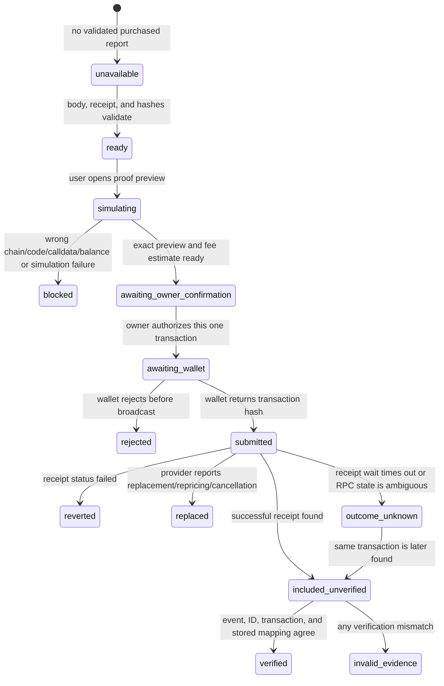

# Signal402 optional registry-attestation wireframe

Status: **pre-event design only; no report-specific attestation UI or
Buildathon-period transaction is claimed.**

This document defines the wallet, contract, receipt, and claim boundaries for
the optional `Signal402Registry` proof action. Implementation begins only after
the official window opens. Every real transaction remains a separately
owner-approved action.

## Verified baseline contract

- Network: Arbitrum Sepolia (`eip155:421614`)
- Canonical address: `0xc896eB3B013a60deCA7029dc2aa4F0da9a5faf82`
- Deployment block: `302861436`
- Runtime code hash recorded at deployment:
  `0x5c14c6ef1925a462bbc828c8a8613c269aad8bd50387ba364181390f5e0f6a7b`
- Source: `contracts/src/Signal402Registry.sol`
- Function: `attest(bytes32 marketId, bytes32 contentHash)`
- Event: `InsightAttested(bytes32 indexed attestationId, bytes32 indexed
  marketId, bytes32 indexed contentHash, address requester, uint64 createdAt)`
- Mapping getter: `attestations(bytes32)`

The deployed contract is pre-event baseline infrastructure. The qualifying
Buildathon work is the report-specific canonical proof, safe user-controlled
interaction, independent receipt/event verification, and evidence produced
during the official window—not the earlier deployment itself.

## What the registry proves—and does not prove

A successfully verified record proves that a wallet submitted two hashes to
this contract and that the transaction was included successfully on Arbitrum
Sepolia. If the submitted `contentHash` recomputes from a disclosed report, it
also proves the disclosed report matches that commitment.

It does **not** independently prove:

- the report is accurate, complete, unbiased, or profitable;
- the market source or model output is true;
- the requester authored, purchased, or owns the report;
- the registry transaction is an x402 payment receipt;
- the wallet has a particular legal or personal identity;
- the report or market identifier is secret;
- mainnet use, revenue, production finality, or endorsement by Arbitrum.

The domain-separated market hash is not encryption. Numeric/public market IDs
can be brute-force enumerated, and low-entropy report candidates can be tested
against a content hash. The registry must be described as a public immutable
hash commitment, not confidential storage.

The contract is permissionless, non-upgradeable, has no admin/revocation path,
and accepts any nonzero pair of hashes from any address. Its data is permanent
at the contract layer. The UI must disclose this before requesting a wallet
transaction.

## Attestation ID lifecycle

The contract computes:

```text
attestationId = keccak256(
  abi.encode(
    marketIdHash,
    contentHash,
    msg.sender,
    block.chainid,
    block.number
  )
)
```

Therefore:

- no authoritative ID exists before the transaction is mined;
- the return value from `simulateContract` uses simulated block context and is
  never displayed as the final ID;
- the final ID must be decoded from the mined `InsightAttested` event and
  independently recomputed with the receipt's actual block number;
- the same wallet can attest the same hashes again in a later block and receive
  a different ID;
- two same-wallet/same-hash transactions included in one block would derive the
  same ID, so only one can succeed because the mapping rejects an existing ID.

Do not call this a content-uniqueness registry or infer “first attestation”
without a complete event-history proof.

## User-visible state machine



No automatic transition may submit a second transaction. `blocked`, `rejected`,
`reverted`, `replaced`, `outcome_unknown`, and `invalid_evidence` all require a
fresh explicit review before any new write.

## Pre-transaction gates

The attestation button stays disabled until all gates pass:

1. The paid report body satisfies the strict versioned schema.
2. The x402 receipt is independently decoded and validated. Attestation remains
   optional even when payment succeeds.
3. `marketIdHash`, canonical JCS bytes, `contentHash`, and calldata are
   recomputed locally from the delivered report, never trusted from display
   fields alone.
4. The connected account is shown and the wallet chain is exactly `421614`.
5. A public client on Arbitrum Sepolia confirms non-empty bytecode at the exact
   canonical address and applies Ethereum `keccak256` to the runtime bytecode;
   the result must equal the recorded runtime code hash. A mismatch blocks the
   feature.
6. The minimal ABI is generated/reviewed from the tracked Solidity source, and
   encoding then decoding the call yields exactly `attest`, `marketIdHash`, and
   `contentHash`.
7. `simulateContract` succeeds with the connected account, canonical address,
   exact arguments, and zero native value. Simulation is a preflight only; it
   is not proof that a future transaction will succeed.
8. Estimate gas and fees without hard-coding a manual gas limit. Show an
   approximate maximum in test ETH and confirm the wallet has sufficient
   Arbitrum Sepolia ETH. The wallet's final estimate remains authoritative.
9. Check the current client recovery record for a pending or already verified
   transaction for the same account/hash pair. Never offer a blind repeat.
10. Present the exact owner-confirmation packet below.

Viem's documented flow pairs
[`simulateContract`](https://viem.sh/docs/contract/simulateContract) with
[`writeContract`](https://viem.sh/docs/contract/writeContract). Simulation is
read-only; `writeContract` returns only a transaction hash, so the mined receipt
and event still require separate verification.

## Exact owner-confirmation packet

Immediately before the real wallet request, show:

- purpose: one optional report-hash attestation;
- connected wallet address;
- chain: Arbitrum Sepolia (`421614`), explicitly not Arbitrum One;
- canonical contract address and verified runtime code hash;
- function signature and exact decoded arguments;
- market ID in readable form plus `marketIdHash`;
- `contentHash` and report schema/hash-domain versions;
- native value: exactly `0 wei`;
- estimated gas and maximum estimated test-ETH fee, with timestamp;
- permanence, permissionless-write, no-revocation, and non-confidentiality
  warning;
- statement that this is separate from the x402 payment and does not prove
  report accuracy;
- whether any earlier/pending transaction exists for the same proof;
- the exact action authorized: open/approve one wallet transaction only.

Approval for an x402 payment, network switch, deployment, or previous registry
transaction does not authorize this attestation. If any displayed account,
chain, address, calldata, hash, fee, or prior-state fact changes after approval,
stop and request confirmation again.

## Broadcast boundary

- The browser wallet is the only signer. No server key, embedded private key,
  seed phrase, delegated signer, or unattended transaction is permitted.
- Use the request returned by the successful simulation, after rechecking chain
  and account immediately before `writeContract`.
- Explicitly set/verify zero native value. Never attach USDC or ETH to the
  nonpayable function.
- Persist the returned transaction hash and its account/chain/hash tuple in a
  bounded client recovery record before beginning receipt polling.
- Disable the submit control while the transaction is pending.
- Never treat a wallet popup closing, RPC timeout, or missing UI callback as
  proof that no transaction was broadcast.

The application may guide the user through an explicit network-switch request,
but the transaction confirmation remains a separate gesture and owner gate.

## Receipt and event verification

After a hash is returned, use an Arbitrum Sepolia public client to obtain the
transaction and receipt. Verify all of the following:

1. receipt status is successful and the receipt transaction hash matches;
2. transaction `from` equals the approved wallet;
3. transaction `to` equals the canonical registry;
4. transaction native value is zero;
5. input decodes to the exact function and two approved hashes;
6. receipt block/hash are present and belong to chain `421614` as configured by
   the public client;
7. exactly one strictly decoded `InsightAttested` log from the canonical
   contract matches both hashes, requester, and receipt transaction;
8. event `createdAt` is nonzero and plausible relative to the receipt block
   timestamp; do not substitute the browser clock;
9. recomputing the ID from the exact ABI tuple and receipt block number equals
   the event ID;
10. `readContract(attestations(eventId))` returns the same market hash, content
    hash, requester, and event timestamp.

Use strict ABI event decoding such as viem
[`parseEventLogs`](https://viem.sh/docs/contract/parseEventLogs); ignore
lookalike events emitted by other addresses. A successful receipt without the
exact event and mapping match is `invalid_evidence`, not a verified
attestation.

The UI may say “included and verified on Arbitrum Sepolia” after these checks.
It must not say “finalized” unless finality is separately proven and defined.

## Retry, replacement, and duplicate behavior

- If the wallet rejects before returning a hash, show `rejected`; no chain
  result is claimed.
- If a hash exists, every recovery attempt queries that hash first. Do not call
  `writeContract` again because polling timed out.
- Handle repriced/replaced/cancelled transactions explicitly. Record both old
  and replacement hashes and verify only the actual included transaction.
- If the provider result is ambiguous before a hash is surfaced, show
  `outcome_unknown`, ask the user to inspect wallet activity, and do not offer
  one-click resubmission.
- The contract permits the same account/content pair again in a later block.
  Client-side duplicate suppression is therefore a safety feature, not a
  contract guarantee.
- A reverted transaction consumes gas but creates no attestation. Do not imply
  that failure is costless.

## Relationship to report and payment

The JSON report contains only the canonical registry call preview and an
initial `attestation.status = "not_requested"`. The server does not mutate the
already delivered paid response after an attestation. A client may create a
separate local view containing report, x402 receipt, and verified registry
record, clearly labeled as client-composed.

An attestation failure, rejection, or omission never invalidates a successfully
purchased report. Conversely, a registry event does not repair a missing or
invalid `PAYMENT-RESPONSE` receipt.

## In-window tests

- ABI selector/event-topic parity with the tracked Solidity artifact;
- non-empty canonical runtime code and exact runtime hash match;
- valid simulation and rejection of either zero hash;
- proof that simulation return data is ignored as a final ID;
- call encode/decode round trip and zero-value transaction request;
- wrong chain, account, address, code hash, function, argument, and gas-balance
  blocks;
- wallet rejection before broadcast;
- receipt success, revert, timeout, replacement, cancellation, and unknown
  outcomes;
- strict rejection of spoof/missing/duplicate/mismatched events;
- event ID recomputation using the actual receipt block;
- mapping readback equality;
- same wallet/hash in later blocks producing distinct IDs, and no claim of
  content uniqueness;
- pending-state recovery that never submits a second transaction;
- proof that the paid report remains usable when attestation is skipped or
  fails;
- log/telemetry tests that expose no private report body or wallet secrets.

## Submission evidence

With separate owner approval, create at most one clean in-window registry
transaction for the selected demo report. Save:

- the reviewed confirmation packet and approval scope outside the public repo;
- transaction, receipt block, connected requester, decoded calldata, and
  explorer URL;
- event fields, recomputed event ID, mapping readback, report/content hash, and
  related commit/deployment ID;
- a redacted screenshot or recording that shows the optional action and result
  without exposing wallet secrets or unrelated activity.

Do not publish the owner's private approval record. Public evidence must call
the transaction testnet-only, optional, and a hash commitment rather than a
truth or ownership oracle.
