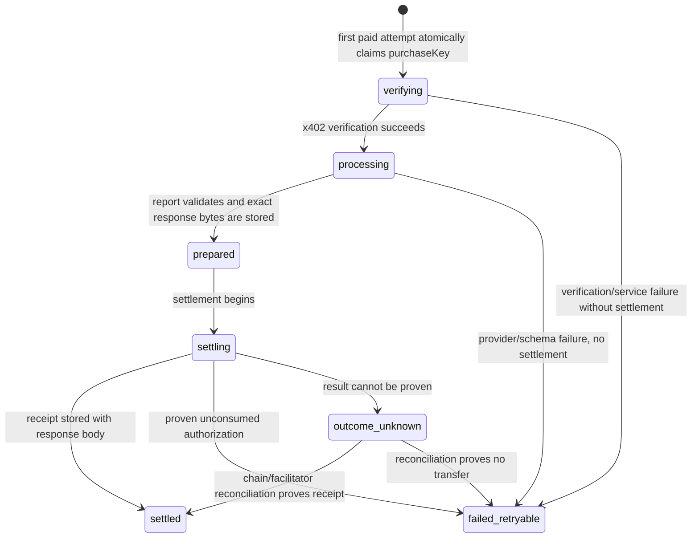

# Signal402 x402 idempotency and replay wireframe

Status: **pre-event design only; no implementation is claimed.**

This document defines the safety target for the in-window agent API. It is
based on the repository's pinned `@x402/*` 2.24.0 packages and the EIP-3009
authorization format. Revalidate those exact dependencies and the deployed
facilitator behavior before implementation.

## Evidence from the current stack

The boundaries below are important because “the token rejects the same nonce”
and “one logical API purchase is charged at most once” are different claims.

| Observed behavior | Consequence |
| --- | --- |
| `ExactEvmScheme` creates a fresh random nonce for each EIP-3009 payload. | A newly created payload is a newly signable payment authorization. |
| The EIP-712 message covers `from`, `to`, `value`, `validAfter`, `validBefore`, and `nonce`; its domain covers the token contract and chain. | The signature does **not** bind the HTTP method, route, `marketId`, request bytes, response schema, or report body. |
| x402 v2 carries `resource` and `accepted` alongside the scheme payload. | Those protocol fields help the server match terms, but they are not part of the EIP-3009 signed message in the pinned exact-EVM implementation. |
| The token consumes an authorization nonce. | Reusing the exact same authorization cannot successfully transfer twice onchain. This is onchain replay protection, not application idempotency. |
| `wrapFetchWithPayment` performs the initial unpaid request and one paid retry. It creates a fresh payload again only when a registered payment-response recovery hook reports recovery. | The current Signal402 client, which registers no recovery hook, does not silently create a third attempt. A new wrapper invocation or future recovery hook could still request a new signature. |
| The current server performs provider work before settlement. | Concurrent delivery of one credential can duplicate provider work, and one branch may lose after the other consumes the nonce. |
| The facilitator package has an in-memory pending-transaction store by default. | This is not evidence of durable, cross-instance recovery on Signal402's serverless deployment or on the external facilitator. |

Primary protocol reference: [EIP-3009](https://eips.ethereum.org/EIPS/eip-3009).
Implementation evidence is the pinned package source under
`front-end/node_modules/.pnpm/@x402+{core,evm,fetch}@2.24.0` after a locked
install. Do not cite unpinned package behavior as proof for the final build.

## Required claim boundary

The final product may claim all of the following only after the corresponding
tests pass:

- the same valid EIP-3009 authorization cannot transfer twice onchain;
- Signal402 does not automatically ask for a second authorization after an
  ambiguous paid transport result;
- concurrent delivery of the same purchase credential is serialized by a
  durable atomic store before provider work;
- a completed replay with the same credential and request returns the stored
  body and stored standard `PAYMENT-RESPONSE` header without provider work or
  settlement;
- a credential or idempotency key reused for different request semantics is
  rejected before provider work and settlement.

Do **not** claim generic “exactly once” delivery. A process can fail after the
chain accepts settlement but before the server durably records the receipt.
That gap requires a separately tested reconciliation path. If reconciliation
cannot prove the transaction and recreate the standard receipt, expose an
`outcome_unknown` state and require an onchain check before any new payment.

## Request identity

The client creates one high-entropy `Idempotency-Key` before the initial unpaid
request and reuses it for every transport attempt belonging to that logical
purchase. It must not silently generate a new key after a paid attempt.

The server derives, rather than trusts, a request fingerprint:

```text
requestFingerprint = keccak256(
  UTF8("signal402:paid-request:v1\n") ||
  JCS_UTF8({
    method: "POST",
    route: "/api/v1/reports",
    marketId: normalizedMarketId,
    responseSchema: "signal402-report-v1",
    network: configuredNetwork,
    asset: configuredAsset,
    amount: configuredAmount,
    payTo: configuredRecipient
  })
)
```

The normalized market identifier follows
`docs/canonical-proof-wireframe.md`. The fingerprint binds request semantics
and quoted payment terms, not volatile source data or the generated report.
Changing any covered value creates a new logical purchase.

For a paid attempt, also derive a credential digest from the exact
`PAYMENT-SIGNATURE` header bytes. The header itself and its signature must
never be written to logs or the replay store. The stored identity is:

```text
purchaseKey      = SHA-256(UTF8("signal402:purchase-key:v1\n" + idempotencyKey))
credentialDigest = SHA-256(raw PAYMENT-SIGNATURE header bytes)
```

Returning a settled report requires all three values to match:
`purchaseKey`, `credentialDigest`, and `requestFingerprint`. The idempotency
key alone is never a bearer credential for paid content.

## Durable state machine

Production requires a server-side store with atomic compare-and-set and a TTL.
An in-memory map is acceptable only for unit tests; it is not acceptable for a
serverless readiness claim.



Atomic rules:

1. A new paid request claims `purchaseKey` before x402 verification, provider
   work, or settlement. Store only bounded digests until verification passes.
2. The same key with a different credential or request fingerprint receives a
   typed conflict and never reaches provider work or settlement. This prevents
   a fresh authorization from being consumed for an existing logical purchase.
3. The same tuple while `verifying`, `processing`, `prepared`, or `settling`
   receives a typed `409` response with a bounded retry instruction. It does
   not start parallel work.
4. `prepared` stores the exact body bytes and their digest before settlement;
   only `settled` may replay them to the caller.
5. A matching `settled` replay returns the stored exact body bytes and stored
   standard settlement header. It never calls the provider or facilitator.
6. `failed_retryable` permits retry only with the same tuple and only after the
   failure proves that the authorization was not consumed.
7. `outcome_unknown` never returns a success receipt and never invites a new
   authorization. Reconciliation must inspect authoritative chain or
   facilitator evidence.
8. Store unavailability fails a paid request closed with a typed service error
   before provider work or settlement. The ordinary unpaid 402 response can
   remain available.

The retention period must cover the authorization's `validBefore` plus a
documented reconciliation grace period. Paid response bytes contain private
report content, so use the shortest proven recovery window, encrypt storage as
appropriate, delete on expiry, and disclose the retention behavior. Never
store wallet private keys, AI credentials, raw payment signatures, or complete
request headers.

## Client behavior

- Show network, asset, amount, recipient, market, and logical purchase ID
  before asking the wallet to sign.
- Treat wallet signing as the sole consent boundary for that purchase. The
  transport may resend the exact signed credential with the same key and body,
  but it must not request a fresh signature automatically.
- Do not install an x402 payment-response recovery hook that can create a fresh
  payload unless it first returns control to an explicit wallet confirmation.
- After a timeout, connection reset, or malformed/missing settlement receipt,
  retain the same idempotency key and credential in memory only long enough to
  query/retry safely. Display `outcome unknown—check settlement before paying
  again`, not a generic “try again” purchase action.
- A deliberate new purchase gets a new idempotency key and a new explicit
  authorization. Never infer this intent from a network error.

## In-window implementation gates

Before enabling the versioned paid endpoint in production:

1. Resolve the provider decision in `docs/replay-store-decision.md` and document
   its operator, region, retention, credentials, and data-processing boundary.
   Creating or connecting an external service and its production secret
   requires owner confirmation.
2. Implement the store behind a narrow interface so unit tests use a local
   deterministic adapter while production refuses to start with the memory
   adapter.
3. Confirm whether the deployed facilitator offers durable idempotent
   settlement lookup. Do not assume the package's default in-memory pending
   store describes the hosted facilitator.
4. Implement and test chain/facilitator reconciliation, or explicitly ship the
   honest `outcome_unknown` stop state without an exactly-once recovery claim.
5. Keep the standard receipt exclusively in `PAYMENT-RESPONSE` as specified in
   `docs/x402-response-boundary.md`.

## Required tests and evidence

- one unpaid request followed by one wallet authorization and one paid retry;
- same key + same credential + same body, sequentially and concurrently;
- same key + same credential + different `marketId`;
- same key + fresh credential and same body;
- fresh key + reused credential;
- provider/schema failure followed by safe reuse of the unchanged credential;
- store outage before verification, before provider work, before settlement,
  and after `prepared`;
- response loss after settlement, including the reconciliation or honest
  `outcome_unknown` path;
- expired authorization and expired replay record;
- missing/malformed settlement header and network mismatch;
- assertions that the provider and settlement call counts remain one under
  concurrent replay;
- assertions that logs, fixtures, and telemetry contain no raw payment header,
  wallet signature, paid report body, or idempotency key.

Final evidence must include a commit-linked state-transition test transcript,
the selected store/configuration boundary, one owner-approved in-window testnet
purchase, and a replay demonstration that creates no second transfer.
